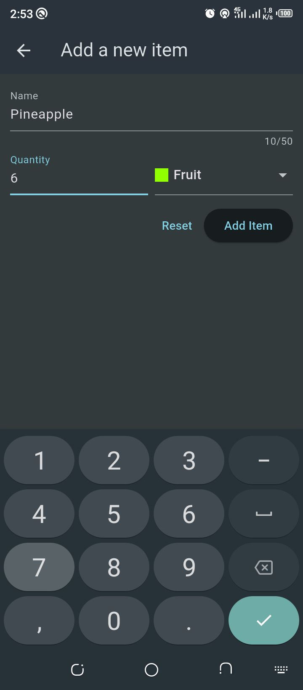
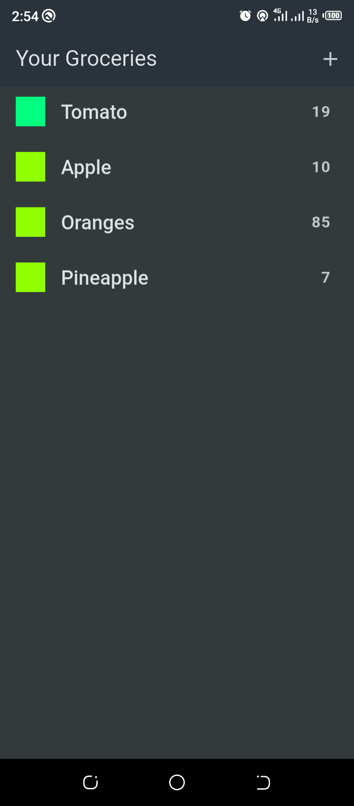

# Shopping List

  

  
   

## Overview

This project is built to get a better understanding about networking (http requests) in flutter. It shows how to perform CRUD operation over a server on the internet. From the above screenshots, the first image is a screen that allows you enter some data, and after clicking the add item button, it then takes you the second screen to see the data added to your list of items in real-time. The http package is made available to enable us handle network requests without complications by providing a set of high-level functions and classes. They allow you to make individual HTTP requests with minimal hassles.

### How to Install and Test the Application

You can clone this project on your local machine. To do that, you must have git installed on your local machine.
**Flutter and Dart** must be installed. Click [here](https://flutter.dev) to download.
**Note:** You can use any server of your choice, but ensure to read up its docs. If you intend to follow with firebase, you must have a firebase account. Click [here](https://firebase.google.com) to learn more about firebase. Also, to learn about using firebase apis, click [here](https://firebase.google.com/docs/reference/rest/database).

1. Open your terminal and navigate to your desired directory
2. Run this command `git clone https://github.com/kenbuzor/shopping_list.git` this will create a directory called shopping_list which houses all the files and folders of the project, it is the project root.
3. Navigate to the cloned project `cd shopping_list/`
4. Open the project on vscode with this command `code .` Note, you can use any code editor of your choice.
5. On your terminal, in the root of your project, run this command to install all necessary dependencies `flutter pub get`
   **Note:** _You must have flutter and dart installed on your local machine_
6. You can now read and modify code to suit your need and test the app on an emulator/simulator or on a real device.

## Dependencies

- **Http** - This plugin is used for handling network requests. It is used in this project to access the firebase realtime database api.

### Reference Links

- [Flutter Official Documentation](https://docs.flutter.dev/)
- [Google Firebase Docs](https://firebase.google.com)
- [Firebase APIs Usage](https://firebase.google.com/docs/reference/rest/database)

## Conclusion

I hope this project has to a large extent simplified how to consume an api in a flutter project.

Happy Coding </>
